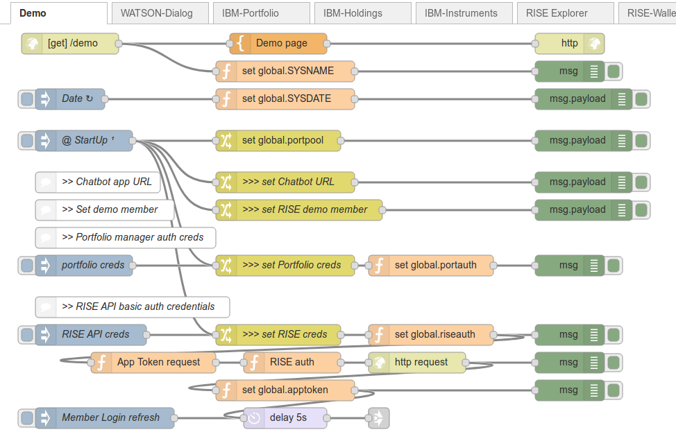
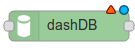
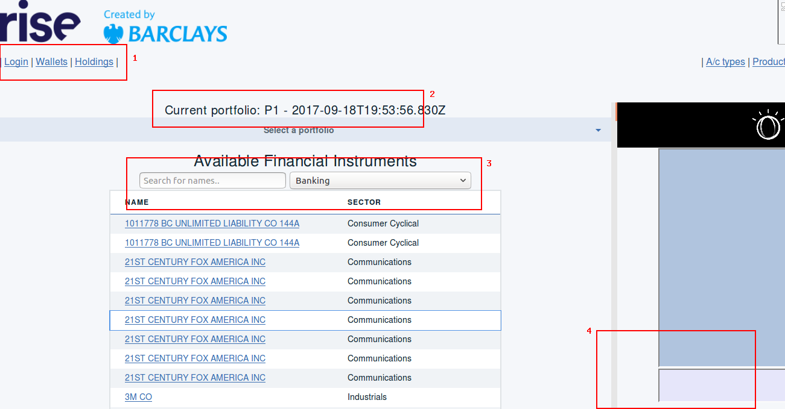

# rise-portfolio-sample

Sample Bluemix application that links IBM Financial Investment tools with Barclays RISE APIs

## Pattern Setup
To get going, make sure to install, configure and validate the IBM Code Pattern - [Create an investment management chatbot]( https://developer.ibm.com/code/patterns/create-an-investment-management-chatbot/)

This will establish a set of services hosted on the **IBM Cloud** platform:
- Investment Portfolio - holds groups of stocks together in portfolios
- Financial Instrumennt Analytics - performance predicts and assessment on a portfolio
- Watson Conversation - a *chatbot* back-end service which performs Natural Language Processing on user input, and directs dialog flows

This application will also create a *node.js* application hosted in IBM Cloud, which will offer a chatbot interface to the default portfolio.

## Wallet application Setup

The Wallet application is built using [Node-RED](http://nodered.org) - this is a open-source visual programming tool, which is ideal for experimenting with APIs and services.

The ability to add new stocks to portfolios is supported by a simple SQL table provided by an instance of the DB2 Warehouse on Cloud service (formerly known as *dashDB*).

After creating a dashDB instance from the IBM Cloud catalog, import the [INSTRUMENTS table](resources/dashDB-INSTRUMENTS.csv) into the default schema - this will then be accessed by the Node-RED wrapper application.

### Node-RED

From the IBM Cloud catalog, create and configure instance of the `Node-RED Starter` Boilerplate.

From the Node-RED editor, select the  menu, navigate to the `Manage Palette` section and install the *dashDB* support node - *node-red-nodes-cf-sqldb-dashdb*.

Open [Flow file](flows.json), and copy the contents to the clipboard; then, from the Node-RED menu, select `Import Clipboard`, paste the flow file, and click `Import`.

Then click the red `Deploy` button, near the menu button.

The application will need some post-install configuration, to establish your `RISE API` keys and tokens.

Select the `Demo` tab, and double-click on each of the Change () nodes with **>>>** in the name; each of these should be configured with username and password, or URL, as required.

** Warning ** when importing flows that have been exported from working environments,
the credentials for some nodes need to be re-established - this is likely for the dashDB  nodes on the `IBM-Instruments` tab; to fix this, all that is required is to
double-click on each, wait for the `Service` name to populate with your Db2 Warehouse on Cloud instance name, and then click `Done`.

Then re-Deploy.

## Demo ##

The demo runtime will pre-authenticate with the RISE API, and login the demo user.

You can launch the demo web page at the `/demo` page of the Node-RED application.

The base page should look similar to this:

The areas highlighted in red -

1. these link to the Member login, the Wallets associated with the Member, and the Stocks (holdings) in the current portfolio
1. this shows the current Portfolio - if blank, select the default portfolio from the drop-down list - it will likely be **P1**
1. this filterable list shows the known financial instruments (stocks) which can be added to the Member's Portfolio. Where known, the links with show current [Markets Insider](http://markets.businessinsider.com/) performance information, as well as the supplied **THEO/value** rate.
[Barclays plc example](resources/rise-demo-stock-barclays.png)
1. this is the Chatbot service connected to the Portfolio manager - enter text in the lower entry field, and the responses with scroll in the upper section.

If you click on the _Wallets_ link, you'll find a list of all wallets associated with the demo user. Look for a wallet name that matches your portfolio name - again, probably **P1**. If it doesn't exist, you will find a *Create a new Wallet* link at the bottom of the list - create the new wallet with the same name as your portfolio.
Reload the wallet list, and click on the *TOPUP* link next to the portfolio wallet; this will allow you to add funds to the wallet (up to 10000 units at a time). The units are currency-independent for demo purposes - there is no currency-conversion performed when "purchasing" shares.

While the *Holdings* link will show the stocks in the portfolio, you can also use the Chatbot dialog to query the portfolio, and ask for projections or advice.
